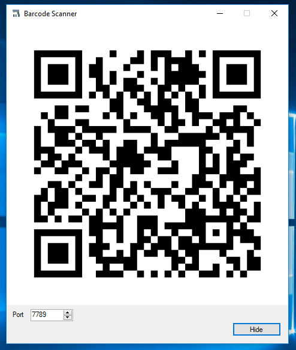

# BarcodeScannerServer
Barcode to PC turns your smartphone into a real barcode scanner.
Supported platforms: Windows

•Keyboard emulation
Your smartphone sends real-time keystrokes directly to your computer, no copy-paste required!

•Wi-Fi ready
Connect to the same network of your PC and the app will pair automatically

   </a>

